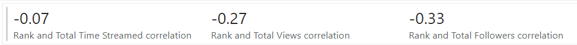

# About Project
&emsp;โปรเจคนี้เป็นโปรเจคเพื่อพัฒนา Data analyst skill โดยจะมุ่งเน้นไปที่ visualization skill เป็นหลัก
ขอขอบคุณแหล่งข้อมูลจาก Kaggle https://www.kaggle.com/datasets/hibrahimag1/top-1000-twitch-streamers-data-may-2024

## About Data
&emsp;ชุดข้อมูล คือข้อมูลและพฤติกรรมของ top 1000 streamers บนแพลตฟอร์ม Twitch ซึ่งเป็นหนึ่งในเว็บไซต์การ stream ที่ใหญ่ที่สุดในโลก (หลายคนอาจคิดว่า Youtube น่าจะใหญ่กว่า แต่ผมมองว่า Youtube เป็นเว็บไซต์ในการเก็บวิดีโอมากกว่า) ข้อมูลถูกดึงด้วยวิธี web scraping โดยเป็นชุดข้อมูลของเดือน พฤษภาคม 2024
&emsp;ข้อมูลชุดนี้ประกอบไปด้วย
- Rank
- Name
- Language
- Types (personality & esports) 
- Most Streamed Game
- 2nd Most Streamed Game
- Average Stream Duration (hr)
- Follower Gained Per Stream
- Avg Viewers Per Stream
- Avg Games Per Stream
- Total Times Streamed
- Total Followers
- Total Views
- Total Games Streamed
- Active Days Per Week
- Most Active Day (Mon-Sun)
- Day With Most Followers Gained (Mon-Sun)

**ข้อมูลบางอย่างเช่น Avg Viewers Per Stream กับ Total Views ในบาง row มีค่าเป็น 0 ซึ่งไม่ใช่ข้อผิดพลาดในการดึงข้อมูล เพียงแต่เป็นข้อมูลที่ไม่ถูกแสดงใน Twitch เอง**

## Data cleansing
&emsp;หลังจากสำรวจข้อมูลดู ก็พบความผิดปกติหลายอย่าง
- อันดับที่ 28 หายไป 
จำนวนของ rows มีทั้งหมด 1000 ซึ่งรวม header ไปแล้ว กล่าวคือมีข้อมูลหายไป 1 บรรทัด เมื่อไล่ดูแล้วพบว่าอันดับที่หายไปคือ อันดับที่ 28 เพื่อความถูกต้อง จึงจะไล่อันดับใหม่ทั้งหมด โดยคนสุดท้ายจะอยู่ที่อันดับ 999 แทน
- เกมที่สตรีม 
ในชุดข้อมูลนี้ streamer แต่ละคนจะแสดงเกมที่สตรีมสูงสุดสองอันดับแรก แยกออกเป็นคอลัมม์ 'Most Streamed Game' กับ '2ND Most Streamed Game' ซึ่งทำให้ไม่สามารถแสดงข้อมูลของเกมโดยรวม จึงต้องทำการสร้างตารางใหม่ขึ้นมาแล้วรวมทั้งสองคอลัมม์เข้าด้วยกันโดยการ unpivot ข้อมูลออกมา
- Rank 
ข้อมูล Rank ของชุดข้อมูลต้นทาง ไม่มีความชัดเจนว่าใช้เกณฑ์ใดในการจัดอันดับ Streamers อาจจะเป็นการจัดอันดับด้วยอัลกอริทึมของทาง Twitch เอง ด้วยเหตุนี้ข้อมูล Rank จึงไม่ถูกนำมาวิเคราะห์ในทางสถิติในรายงานนี้

## Main Problems
&emsp;คำถามเพื่อเป็นแนวทางในการ visualize ข้อมูลชุดนี้
- รูปแบบการกระจายตัวของ Streamers บนแพลตฟอร์มเป็นอย่างไร 
&emsp;การมองเห็นภาพรวมของการกระจายตัวจะช่วยให้สามารถวิเคราะห์ลักษณะพฤติกรรมของทั้งคนดูและ Streamers ได้ อะไรที่เป็น trends? ความต่างระหว่าง Streamer ที่มีผู้ติดตามอันดับ 1 กับอันดับที่ 100 ต่างกันแค่ไหน? 
- เกมยอดนิยมในเดือนนี้คือเกมอะไร 
&emsp;เกมที่ยอดนิยมย่อมดึงดูดคนที่สนใจเข้ามา การที่ Streamers เลือกเกมที่น่าสนใจเข้ามามีผลต่อยอดคนดูแค่ไหน? ตัวคนดูให้ความสำคัญอะไรมากกว่า ระหว่างเกมที่เล่นหรือตัว Streamer เอง? เนื่องจากข้อมูลชุดนี้เป็นข้อมูลประจำเดือน พฤษภาคม 2024 ทำให้ไม่สามารถบอกได้ว่าเกมที่สตรีมเป็นเกมที่เป็นกระแสชั่วคราว หรือเป็นเกมที่ Streamer นั้น ๆ เล่นเป็นหลัก
- ปัจจัยอะไรที่ส่งผลต่อยอดผู้ติดตามที่เพิ่มขึ้น 
&emsp;นอกจากเกมแล้ว อะไรที่เป็นปัจจัยที่ดึงดูดคนผู้ติดตามใหม่ ๆ เข้ามา ภาษาที่ใช้? ชื่อเสียงดั้งเดิม? วันที่สตรีม? เวลาที่สตรีม? หากมีผู้ติดตามดั้งเดิมสูงอยู่ จะมีผู้ติดตามหน้าใหม่เข้ามาน้อยลงหรือไม่? เพื่อเป็นการวางแผนแนวทางในการทำคอนเทนต์สำหรับ Streamers หน้าใหม่

## Visualizations
- Outlier 
&emsp;สำรวจกระจายตัวของข้อมุล มองหา outlier โดยการใช้ Box plot แสดงข้อมูล
ผลปรากฎว่ามี Outlier จำนวนมาก ส่วนมากเป็น Streamers ระดับต้น ๆ ของ Twitch แล้วข้อมูลส่วนใหญ่จะรวมกลุ่มกันในช่วงต่ำ กล่าวได้ว่าการกระจายเป็นแบบเบ้ขวา Streamer ระดับต้น (ซึ่งเป็นส่วนน้อย) มีความโด่งดังทิ้งห่างจากคนอื่นมาก ๆ
- Followers Correlation 
&emsp;เพื่อตอบคำถามว่าปัจจัยอะไรที่มีผลต่อผู้ติดตามใหม่ ๆ จะใช้การหาค่าความสัมพันธ์ระหว่าง 2 ตัวแปร (Correlation) โดยตัวแปรที่หลักคือ จำนวนผู้ติดตามต่อสตรีม
&emsp;ซึ่งผลของการดูค่าความสัมพันธ์ในภาพรวมพบว่าปัจจัยอื่นแทบไม่เกี่ยวข้องกับการเพิ่มขึ้นของยอดผู้ติดตามเลย เป็นไปได้ว่าคนดูให้ความสำคัญในเกมที่สตรีมและที่ตัว Streamer เอง มากกว่าปัจจัยอื่น ๆ
